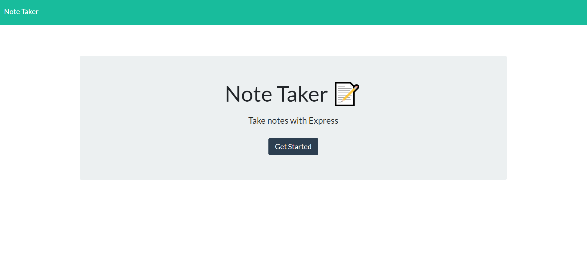
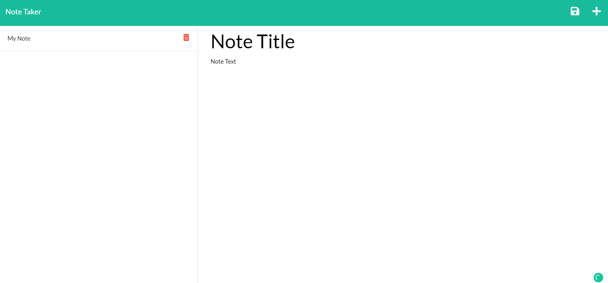
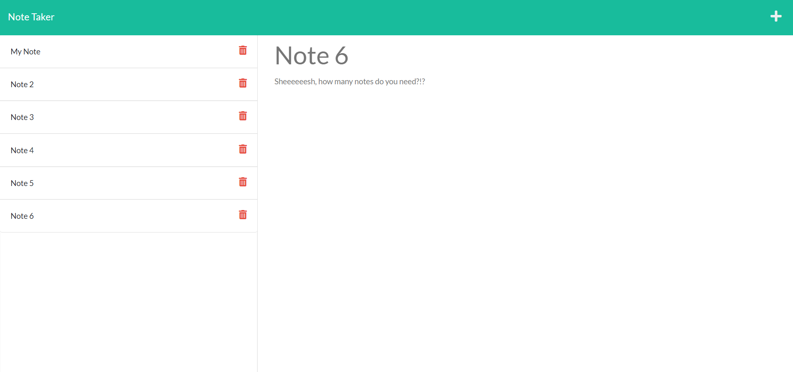

# Note-Taker
## Website

https://note-taker-mavila6.herokuapp.com/

## Description

A note-taking application used to write and save notes in order to increase productivity by keeping track of ideas and to-do items.

## Table of Contents

- [Built With](#built-with)
- [Installation](#installation)
- [Usage](#usage)
- [Screenshots](#screenshots)
- [Acknowledgements](#acknowledgements)
- [Questions](#questions)
- [Author](#author)

### Built-With

### Installation

Clone the repository in the CLI: `git clone https://github.com/mavila6/note-taker.git`. To install necessary dependencies, run the following code in the console: `npm i`.

### Usage

Run `npm start` in the command line to initiate the server or `npx nodemon` to start the live server. Go ahead and navigate to localhost port 3001 in your browser to test the application.

### Screenshots

### Acknowledgements

- Used [front-end code](https://github.com/coding-boot-camp/miniature-eureka) from [The Coding Bootcamp](https://github.com/coding-boot-camp) GitHub.

- Collaborated with [Kama Castaneda](https://github.com/kamacasta) to complete this challenge.

### Questions

If you have any questions feel free to take a look at my [GitHub](https://github.com/undefined) or contact me at mavila6@email.arizona.edu

### Author

&copy; 2021 Marco Avila